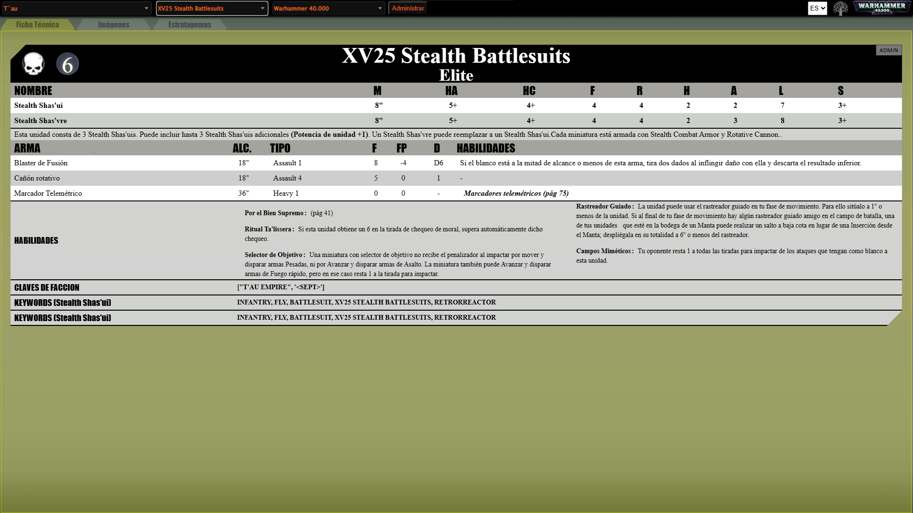

# Warhammer Lexicon


## Project Description
This is a tool to store the rules for any unit in warhammer allowing for easy equipment identifying.

Live Demo: https://warhammer.iskarion.ddns.net



## Install / Deploy Instructions
 1. Clone Repository
    ```bash
    git clone git@github.com:pinakure/MegaNgine.git /src/warhammer
    ```
 2. Get up the container
    ```bash
    cd /src/warhammer
    docker compose up --build -d
    ```
 3. Create Administrative User
    ```bash
    docker exec -it python manage.py createsuperuser
    ```
 4. Access to the Backoffice

    You can add content navigating to ```http://<desired-domain>/admin/```    
    Afterwards you can add contents to the database through the Admin UI.
